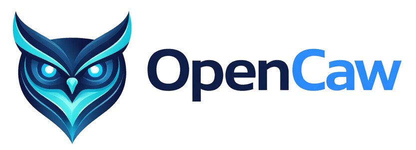
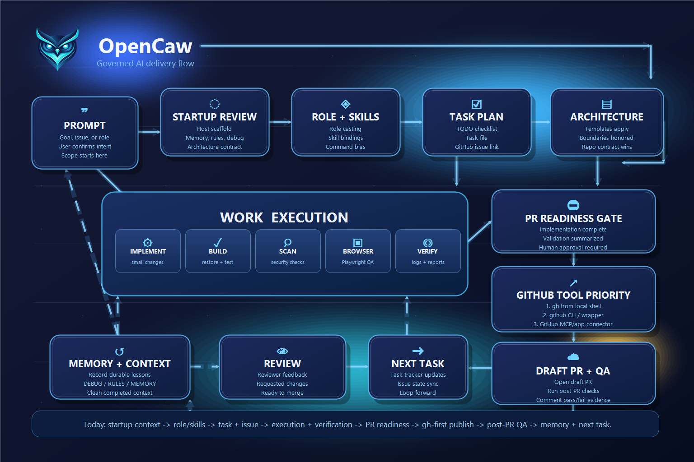

# OpenCaw



OpenCaw is an **open source framework library for AI-assisted development** that standardizes instructions, skills, commands, and architecture guidance for tools such as **Cursor, Codex, and Claude**.

It provides a structured system that allows teams to:

- Standardize AI agent behavior across repositories
- Reuse architecture frameworks and coding standards
- Define reusable commands and skills
- Offload memory and learning fragments into project-local storage
- Maintain consistent enterprise-ready development workflows

OpenCaw is designed so it can be installed into an existing repository as a **submodule or cloned tool directory** (such as `.codex`, `.cursor`, or `.claude`) while keeping project-specific artifacts separate from the shared instruction system.



---

# Table of Contents

- [Install](#install)
- [Examples](#examples)
- [Contributing](#contributing)
- [Architecture Frameworks](#architecture-frameworks)
- [Roles](#roles)
- [Role-Skill Bindings](#role-skill-bindings)
- [Skills](#skills)
- [Commands](#commands)
- [Skills & Commands Guide](#skills--commands-guide)
- [Validation](#validation)
- [Task Management](#task-management)
- [AI Memory System](#ai-memory-system)
- [License](#license)

---

# Install

## Fork OpenCaw First (Required)

Before installing OpenCaw in your project, **you must first fork the repository**.

This ensures:

- you control updates
- you can modify roles, skills, or commands
- upstream updates can be merged safely
- any enterprise security policies are satisfied

### Fork the repository

Visit:

https://github.com/TimothyMeadows/OpenCaw

Click **Fork** and create a fork under your GitHub account or organization.

Example fork location:

```
https://github.com/<your-org>/OpenCaw
```

After forking, use **your fork URL** in all installation commands instead of the upstream repository.

OpenCaw can be installed in an existing repository in two primary ways.

## Option 1 — Git Submodule (Recommended)

Submodules allow the instruction system to be updated centrally while individual projects control the version they use.

Example installation as `.codex` or `.cursor` or `.claude`:

```bash
git submodule add https://github.com/<your-org>/OpenCaw .codex
git submodule update --init --recursive
```

or

```bash
git submodule add https://github.com/<your-org>/OpenCaw .cursor
```

or

```bash
git submodule add https://github.com/<your-org>/OpenCaw .claude
```

Update at anytime:

```bash
git submodule update --remote
```

---

## Option 2 — Clone (Independent Copy)

If a repository needs a customized version of OpenCaw, it can be cloned instead.

```bash
git clone https://github.com/<your-org>/OpenCaw .codex
```

or

```bash
git clone https://github.com/<your-org>/OpenCaw .cursor
```

or

```bash
git clone https://github.com/<your-org>/OpenCaw .claude
```

This allows you to modify instructions without affecting the upstream repository.

---

# Examples

 These are some examples in how to use OpenCaw after it's been installed.

```text
use role security-engineer + sre and review this repository for vulnerabilities and recommend fixes
```

```text
use role qa-engineer and generate full test coverage for the current feature including edge cases
```

```text
use role devops-engineer and create a CI/CD pipeline as a github action for gcp with build, test, and deploy stages for this repository
```

```text
use role fullstack-engineer and build a calculator app with a simple UI, basic arithmetic operations, tests, task tracking, architecture generation if missing, and final verification
```

## What happens?

OpenCaw deterministically resolves your prompt into:

1. **Roles activated** → sets perspective and priorities  
2. **Skills selected** → plans and reasons about the work  
3. **Tasks created/updated** → `.ai/tasks/TODO.md` + `.ai/tasks/<task>/TASK.md`
4. **Architecture ensured** → generates `ARCHITECTURE.md` if missing  
5. **Commands executed** → builds, tests, scans, or deploys  
6. **Verification performed** → tests/logs prove correctness  
7. **Memory updated** → `.ai/` captures reusable lessons  

To be more specific it will:

1. activate the `fullstack-engineer` role
2. check whether `ARCHITECTURE.md` exists
3. if missing, ask which architecture templates apply
4. generate `ARCHITECTURE.md`
5. update `.ai/tasks/TODO.md` with an ordered checklist
6. create a task file such as:
   - `.ai/tasks/create-calculator-app/TASK.md`
7. apply appropriate skills such as:
   - `plan-task`
   - `feature-end-to-end`
   - `api-ui-integration` if relevant
   - `full-flow-testing`
   - `verify-changes`
8. use appropriate commands based on the stack, such as:
   - `./commands/npm-install.sh`
   - `./commands/npm-build.sh`
   - `./commands/npm-test.sh`
   - or `.NET` build/test commands if the chosen architecture includes .NET
9. implement the application
10. run validation and verification before completion
11. update memory files if durable lessons are discovered

This is the intended OpenCaw experience:

- The user gives one high-level prompt
- OpenCaw resolves the role
- OpenCaw selects the right skills
- OpenCaw uses the right commands
- OpenCaw creates task structure and verification flow
- OpenCaw completes the work in a governed, repeatable way

The detailed example below shows the same work broken down step by step for users who want to see the full workflow explicitly.

# Contributing

Contributions to OpenCaw are welcome.

Typical workflow:

1. Fork the repository
2. Create a feature branch
3. Implement your improvement
4. Submit a pull request

Example:

```bash
git clone https://github.com/<your-org>/OpenCaw
cd OpenCaw
git checkout -b feature/add-architecture-framework
```

After making changes:

```bash
git add .
git commit -m "Add new architecture framework"
git push origin feature/add-architecture-framework
```

Then open a pull request against the main repository.

When contributing:

- Keep architecture frameworks **enterprise-ready**
- Maintain **clear documentation**
- Follow existing file structure and conventions

---
# Architecture Frameworks

OpenCaw supports multi-architecture repositories.  

Frameworks are located in:

```
.architecture/
```

These frameworks allow AI agents to generate a unified `ARCHITECTURE.md` file for a repository by combining multiple architecture standards.

Example supported frameworks include:

- DOTNET
- NODE
- MAUI
- PYTHON
- NEXTJS
- SPA
- REACT
- ANGULAR
- VUE
- AZURE
- TERRAFORM
- KUBERNETES
- HELM
- MICROSERVICES
- EVENT_DRIVEN
- GITHUB_ACTIONS
- AZURE_DEVOPS

Agents will ask which architectures apply if `ARCHITECTURE.md` does not exist and generate it automatically.

---

# Roles

OpenCaw includes a library of engineering roles in:

```text
.roles/
```

Each role is stored as:

```text
.roles/<role-name>/ROLE.md
```

To browse available roles, categories, and aliases, see:

```text
.roles/INDEX.md
```

## Role activation

To activate a role, the user can request a matching role name or a common alias.

Examples:

- `use role backend-architect`
- `use role security`
- `act as sre`

If a matching role exists, the agent should load the corresponding `ROLE.md` into the session.

## Multi-role composition

OpenCaw also supports combining roles in one session.

Examples:

- `use role backend-architect + security-engineer`
- `use roles frontend-developer + qa-engineer`

When multiple roles are requested:
- the first role acts as the primary perspective by default
- later roles add specialist constraints, review lenses, or guidance
- stricter or safer guidance should win when roles conflict, unless the user says otherwise

---

# Role-Skill Bindings

OpenCaw includes default bindings between common engineering roles, reusable skills, and preferred commands.

See:

```text
.roles/ROLE_SKILL_MAP.md
.roles/ROLE_SKILL_MAP.json
```

These mappings allow role casting to do more than change tone or perspective.

When a role is activated, OpenCaw should:

- prioritize the skills associated with that role
- prefer commands associated with that role
- apply shared skills such as planning, debugging, review, refactoring, and verification
- bias reasoning toward the role's domain expertise

Examples:

- `backend-architect` → architecture review, service boundaries, dependency audits
- `frontend-developer` → components, feature modules, rendering, accessibility
- `fullstack-engineer` → end-to-end feature delivery, API/UI integration, full-flow verification
- `security-engineer` → threat modeling, security audits, dependency vulnerability review
- `sre` → incident analysis, resilience design, performance review

Multi-role sessions should merge bindings in the same order as the requested roles.

---

# Skills

Skills provide reusable instructions for AI agents to perform structured tasks.

Example skill locations:

```
skills/
skills/generate-architecture/
skills/dotnet-build/
skills/test-runner/
```

Skills should:

- Define clear intent
- Provide deterministic instructions
- Avoid hidden behavior

---

# Commands

Commands provide reusable CLI workflows for automation tasks.

Examples include:

```
commands/generate-architecture.sh
commands/dotnet-build.sh
commands/dotnet-test.sh
commands/security-scan.sh
commands/deploy.sh
commands/run-inference.sh
```

Commands should remain:

- deterministic
- platform-safe
- clearly documented

---

# Validation

OpenCaw includes built-in validation commands for its role, skill, and command schemas.

Available commands:

```text
commands/validate-roles.sh
commands/validate-skills.sh
commands/validate-commands.sh
commands/validate-opencaw.sh
```

Recommended usage:

```bash
./commands/validate-opencaw.sh
```

Or run individual checks:

```bash
./commands/validate-roles.sh
./commands/validate-skills.sh
./commands/validate-commands.sh
```

These validators check:

- `.roles/SCHEMA.md` compliance
- `skills/SCHEMA.md` compliance
- `commands/SCHEMA.md` compliance
- naming conventions
- required metadata and sections
- executable shell command requirements

---

# Task Management

OpenCaw supports structured task tracking using the `.ai/tasks` directory.

```
.ai/tasks/
.ai/tasks/TODO.md
.ai/tasks/<task-name>/TASK.md
```

Rules:

- `TODO.md` contains the ordered list of tasks
- Each task folder contains a detailed `TASK.md`
- Agents update progress as tasks are completed

---

# AI Memory System

AI learning artifacts are stored outside the tool directory to prevent pollution of the shared instruction system.

Example:

```
.ai/
.ai/MEMORY.md
.ai/RULES.md
.ai/DEBUG.md
```

These files allow agents to:

- record lessons learned
- prevent repeated mistakes
- store debugging knowledge

---

# License

OpenCaw is released under the MIT License.

See the `LICENSE` file for full details.


# Skills & Commands Guide

OpenCaw separates **thinking** from **execution** using:

- **Skills** → reusable reasoning patterns (WHAT to do)
- **Commands** → deterministic scripts (HOW to do it)

---

## Skills

Skills live in:

```
./skills/<skill-name>/SKILL.md
```

They are automatically used by the agent when relevant or when a role is active.

### How to use skills

You can explicitly invoke a skill:

```
use skill plan-task
use skill debug-issue
use skill review-code
```

Or combine them:

```
use skill plan-task + review-code + verify-changes
```

### Common Skills

| Skill | Purpose |
|------|--------|
| `plan-task` | Create structured implementation plan |
| `debug-issue` | Diagnose bugs using evidence |
| `review-code` | Evaluate quality and risks |
| `refactor-code` | Improve structure without changing behavior |
| `verify-changes` | Prove correctness via tests/logs |

### Role-Driven Skills

When using roles:

```
use role backend-architect
```

Skills are automatically prioritized:

- architecture design
- dependency analysis
- scalability evaluation

---

## Commands

Commands live in:

```
./commands/*.sh
```

They are executable scripts used for repeatable workflows.

### How to use commands

Run directly:

```bash
./commands/validate-opencaw.sh
```

Or invoke via agent:

```
run command validate-opencaw
run command dotnet-build
```

---

## Common Commands

| Command | Purpose |
|--------|--------|
| `validate-opencaw.sh` | Validate entire OpenCaw setup |
| `dotnet-build.sh` | Build .NET project |
| `dotnet-test.sh` | Run tests |
| `run-tests.sh` | Run repo tests |
| `deploy.sh` | Execute deployment |
| `security-scan.sh` | Run security checks |

---

## Skill + Command Workflow

Example:

```
use role backend-developer
use skill plan-task
```

Then:

```bash
./commands/dotnet-build.sh
./commands/dotnet-test.sh
```

---

## Best Practices

- Use **skills first** to plan and reason
- Use **commands second** to execute
- Combine roles + skills for precision
- Always verify with commands before completion

---

## Mental Model

| Layer | Responsibility |
|------|--------------|
| Role | Perspective |
| Skill | Thinking |
| Command | Execution |

---
