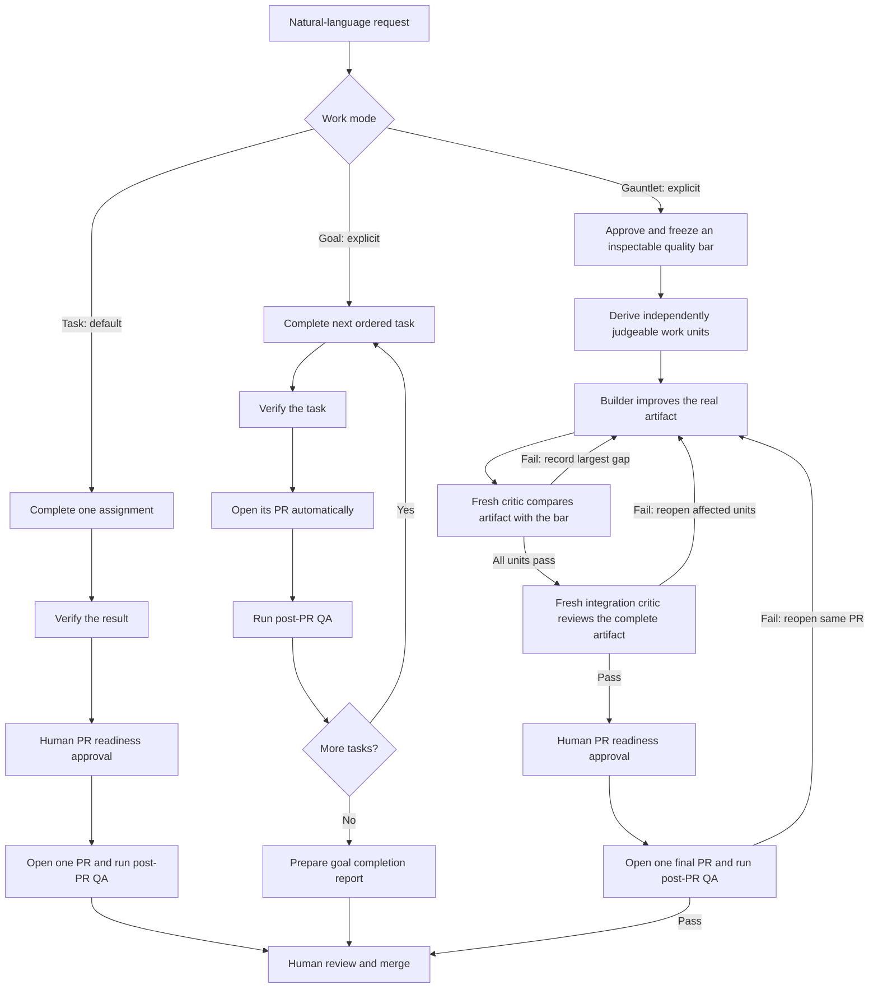

# OpenCaw


https://github.com/user-attachments/assets/eb32b378-7269-4aa7-90d4-cbc0cba535f9

OpenCaw helps you work with an AI coding agent the way you would work with a thoughtful teammate: describe what you want in ordinary language, refine the plan together, and let the agent handle the repository-specific machinery.

You do **not** need to memorize role names, invoke skills, or know command syntax before you can use it. Those controls are available when you want extra precision, but the normal interface is simply a conversation.

```text
Help me plan a safe migration from our legacy checkout flow. Do not change code yet. Inspect the repository, identify the risky boundaries, and propose reviewable phases with tests and rollback points.
```

That is a complete OpenCaw request.

Behind the conversation, OpenCaw provides a shared system for planning, architecture, implementation, task tracking, repository memory, verification, and delivery across tools such as **Cursor, Codex, and Claude**. It can be mounted as `.codex`, `.cursor`, or `.claude` while keeping project-specific context inside the host repository.


```mermaid
flowchart TB
    accTitle: OpenCaw task, goal, and Gauntlet workflows
    accDescr: A request enters task mode by default, explicit goal mode for an ordered series of task pull requests, or explicit Gauntlet mode for repeated builder and independent critic rounds followed by one pull request.

    Request["Natural-language request"] --> Mode{"Work mode"}

    Mode -->|"Task: default"| Task["Complete one assignment"]
    Task --> TaskVerify["Verify the result"]
    TaskVerify --> TaskGate["Human PR readiness approval"]
    TaskGate --> TaskQA["Open one PR and run post-PR QA"]
    TaskQA --> HumanMerge["Human review and merge"]

    Mode -->|"Goal: explicit"| GoalTask["Complete next ordered task"]
    GoalTask --> GoalVerify["Verify the task"]
    GoalVerify --> GoalPR["Open its PR automatically"]
    GoalPR --> GoalQA["Run post-PR QA"]
    GoalQA --> GoalMore{"More tasks?"}
    GoalMore -->|"Yes"| GoalTask
    GoalMore -->|"No"| GoalReport["Prepare goal completion report"]
    GoalReport --> HumanMerge

    Mode -->|"Gauntlet: explicit"| Bar["Approve and freeze an inspectable quality bar"]
    Bar --> Units["Derive independently judgeable work units"]
    Units --> Build["Builder improves the real artifact"]
    Build --> Critic["Fresh critic compares artifact with the bar"]
    Critic -->|"Fail: record largest gap"| Build
    Critic -->|"All units pass"| Integration["Fresh integration critic reviews the complete artifact"]
    Integration -->|"Fail: reopen affected units"| Build
    Integration -->|"Pass"| GauntletGate["Human PR readiness approval"]
    GauntletGate --> GauntletQA["Open one final PR and run post-PR QA"]
    GauntletQA -->|"Pass"| HumanMerge
    GauntletQA -->|"Fail: reopen same PR"| Build
```

---

# Table of Contents

- [Start with a Normal Request](#start-with-a-normal-request)
  - [No Magic Words](#no-magic-words)
  - [Choose a Work Mode](#choose-a-work-mode)
  - [Planning Is a Conversation](#planning-is-a-conversation)
  - [A Realistic Planning Flow](#a-realistic-planning-flow)
  - [What OpenCaw Does Behind the Scenes](#what-opencaw-does-behind-the-scenes)
  - [Natural-Language Examples](#natural-language-examples)
  - [When Explicit Controls Help](#when-explicit-controls-help)
- [Install](#install)
  - [Fork OpenCaw First](#fork-opencaw-first)
  - [Choose a Mount Name](#choose-a-mount-name)
  - [Windows Bash Prerequisite](#windows-bash-prerequisite)
  - [Option 1 — Git Submodule](#option-1--git-submodule)
  - [Option 2 — Clone](#option-2--clone)
  - [Start the First Session](#start-the-first-session)
- [Technical Reference](#technical-reference)
  - [Runtime Model](#runtime-model)
  - [Session Startup and Context Resolution](#session-startup-and-context-resolution)
  - [Repository Layering](#repository-layering)
  - [Architecture, Style, and Media Contracts](#architecture-style-and-media-contracts)
  - [Roles](#roles)
  - [Role, Skill, and Command Bindings](#role-skill-and-command-bindings)
  - [Skills](#skills)
  - [Commands](#commands)
  - [Sub-Agent Orchestration](#sub-agent-orchestration)
  - [Task, Goal, and Gauntlet Modes](#task-goal-and-gauntlet-modes)
  - [Task, Issue, and PR Delivery](#task-issue-and-pr-delivery)
  - [Memory v2](#memory-v2)
  - [Generative Media](#generative-media)
  - [Validation](#validation)
  - [Repository Layout](#repository-layout)
- [Contributing](#contributing)
- [License](#license)

---

# Start with a Normal Request

OpenCaw is not a command language wrapped around an AI. It is a repository-aware operating system for the conversation you were already going to have.

Start with the outcome:

```text
The settings screen has become hard to maintain. Help me understand why, propose a cleaner structure, and then make the smallest safe refactor with tests.
```

You can add constraints naturally:

```text
Keep the public API stable. Do not add dependencies. Show me the plan before editing, and stop for approval before opening a PR.
```

You can correct direction naturally too:

```text
That plan is too broad. Keep the database untouched and split the UI cleanup from the API work.
```

OpenCaw uses the baseline instructions, project contracts, repository structure, task state, and relevant memory to turn that conversation into governed work. You can stay at this level for the whole task.

## No Magic Words

Role and skill names are **optional controls**, not required incantations.

| You can simply say | OpenCaw can interpret it as |
| --- | --- |
| “Before coding, help me work out the safest approach.” | Inspect context, identify decisions, and produce a plan. |
| “Find the root cause and prove the fix.” | Diagnose, implement a focused correction, and run verification. |
| “Review this like a security-minded senior engineer.” | Apply a security review lens without requiring a role name. |
| “This is large; split only the parts that can safely run in parallel.” | Plan bounded sub-agent lanes when parallelism is useful and available. |
| “Take this from idea through a reviewed PR, but ask before publishing.” | Track the task, implement, validate, then stop at the PR readiness gate. |
| “Remember this repository rule for next time.” | Validate and store durable project knowledge under `.ai/`. |

These prompts are examples, not fixed syntax. Equivalent natural wording works.

You may still say `use role security-engineer`, invoke a named skill, or request a command when you know exactly which control you want. OpenCaw does not require that level of specificity to plan or complete ordinary work.

## Choose a Work Mode

OpenCaw has three work modes. A normal specific assignment uses task mode; goal and Gauntlet modes begin only when you explicitly request them.

| Mode | Best for | Completion | PR behavior |
| --- | --- | --- | --- |
| Task | One specific assignment | The requested result passes its relevant verification | One PR after human readiness approval |
| Goal | An ordered collection of tasks | Every task is done and its post-PR QA has completed | A PR may open automatically for each task; merging remains human-controlled |
| Gauntlet | One ambitious, inspectable deliverable that benefits from adversarial iteration | Every active work unit and a fresh integration review pass an approved quality bar | One final PR after human readiness approval |

For ordinary work, describe the assignment directly:

```text
Fix the duplicate invoice bug, add a regression test, and stop when the branch is ready for my PR approval.
```

Use goal mode when several tasks should advance automatically through separate PRs:

```text
Use goal flow for these four migration tasks. Validate and open each task PR, run its post-PR QA, then continue. Never merge automatically.
```

Use Gauntlet mode when the result should survive repeated independent comparison against a concrete benchmark:

```text
Use gauntlet mode for this onboarding redesign. First propose an inspectable quality bar for my approval. Use separate builders and fresh critics, and keep one final PR behind my readiness approval.
```

Gauntlet mode is appropriate only when a critic can inspect the real output—such as running code, rendered pixels, test or performance results, a finished document, or another concrete artifact. It never permits the builder to grade its own work.

## Planning Is a Conversation

Planning is where natural-language use is often most powerful.

You can begin with uncertainty:

```text
I know the reporting module needs to be modernized, but I am not sure where to start. Inspect it and help me turn the problem into a safe sequence of decisions and changes. Do not implement anything yet.
```

OpenCaw can then:

1. Resolve the repository boundary and load the relevant project context.
2. Inspect the current architecture, active tasks, tests, and likely change surface.
3. Separate facts from assumptions and identify decisions only you can make.
4. Draft an ordered plan with dependencies, risks, verification, and rollback points.
5. Let you revise the plan in plain language.
6. Record the agreed task structure before implementation.
7. Keep the plan current when discoveries change the direction.

Useful planning phrases include:

```text
Plan this with me before touching code.
```

```text
Give me three options and recommend one, including migration and rollback costs.
```

```text
Turn this idea into small PR-sized tasks and call out what can run in parallel.
```

```text
Assume zero downtime and no schema breaking changes. What does that change in the plan?
```

```text
We learned the API is shared by mobile. Stop and re-plan around backward compatibility.
```

You are not locked into the first plan. OpenCaw treats corrections, new evidence, and changed constraints as reasons to update the plan rather than push through stale assumptions.

## A Realistic Planning Flow

Here is a complete interaction without role or skill syntax:

```text
You:
Our authentication code is spread across the API and web app. I want a simpler design, but I cannot break mobile clients. First inspect the repository and give me a phased plan. Do not edit yet.

OpenCaw:
Inspects the architecture, authentication boundaries, active issues, tests, and relevant repository memory. Returns a plan with assumptions, compatibility risks, phases, and verification.

You:
Keep token formats unchanged in phase one. Separate observability from the refactor, and make the first task small enough for one reviewer.

OpenCaw:
Updates the plan, narrows phase one, and makes the dependency order explicit.

You:
Implement phase one. Add focused tests, run the broader validation, and tell me when it is ready for a PR.

OpenCaw:
Creates or updates task tracking, implements the agreed slice, verifies it, records reusable findings, and stops at the PR readiness gate.
```

The named machinery is still there—roles, skills, commands, task files, memory, and validation—but it supports the conversation instead of replacing it.

## What OpenCaw Does Behind the Scenes

For a substantial request, the normal flow is:

1. **Resolve the project safely** — find the actual host repository and mounted OpenCaw directory without guessing across workspace boundaries.
2. **Load high-signal context** — read protected repository memory, project rules, architecture/style contracts, active tasks, and relevant tagged knowledge.
3. **Understand the request** — distinguish the desired outcome, constraints, assumptions, authorization boundaries, and definition of done.
4. **Select and plan the work contract** — use task mode by default or an explicitly requested goal or Gauntlet lifecycle, then plan at the depth its risks and dependencies require.
5. **Choose capabilities** — apply baseline behavior and automatically use relevant skills; explicit roles remain optional specialist lenses.
6. **Track real work** — create or import a task, link its GitHub issue, and keep the active checklist concise.
7. **Implement carefully** — make focused changes, preserve unrelated work, and use safe parallel lanes only when they genuinely help.
8. **Prove the result** — run targeted tests, broader validation, logs, browser checks, or artifacts appropriate to the risk.
9. **Preserve durable learning** — record verified, reusable repository facts and keep the semantic map current.
10. **Deliver by mode** — task and Gauntlet work pause for human PR approval; explicit goal flow may publish each validated task PR automatically; every path preserves post-PR QA and human merge control.

OpenCaw can do this even if your prompt never mentions a role, skill, command, task file, memory tag, or validation script.

## Natural-Language Examples

### Understand a repository

```text
I am new to this codebase. Explain how a request moves from the API entry point to storage, show me the important files, and call out the parts that are risky to change.
```

### Plan a feature

```text
Help me plan team invitations. We need expiring links, audit history, and no new infrastructure. Ask me only for decisions that materially change the design, then produce reviewable implementation tasks.
```

### Build a feature

```text
Add CSV export to the reporting page. Match the existing architecture, keep the UI accessible, add tests, and verify the download in a browser. Do not publish anything until I approve the PR.
```

### Diagnose a bug

```text
Users occasionally see duplicate invoices after retrying checkout. Find concrete evidence for the root cause, fix it without changing the public API, and add a regression test.
```

### Review without editing

```text
Review this pull request for correctness, security, and maintainability. Do not change files. Rank findings by severity and point to the exact evidence.
```

### Work from an issue

```text
Work on #123. Import the issue into task tracking, implement the smallest complete fix, test it, and prepare the PR readiness summary.
```

### Plan safe parallel work

```text
This migration is large. Split independent investigation, implementation, and QA work into safe lanes, avoid overlapping write scopes, then integrate and verify everything from the main lane.
```

### Create visual or media assets

```text
Help me define the visual direction for this onboarding flow, produce a reusable style contract, and stage a small set of image concepts for review without promoting them into runtime assets yet.
```

### Improve the process itself

```text
We keep rediscovering the same Windows path issue. Verify the pattern, fix the workflow, add a regression check, and remember the durable rule for future tasks.
```

## When Explicit Controls Help

Natural language is the default. Explicit controls are useful when you want to constrain *how* OpenCaw approaches the work.

| Control | Use it when | Example |
| --- | --- | --- |
| Role | You want a named specialist perspective or composition order. | `Use roles backend-architect + security-engineer.` |
| Skill | You want one exact reusable workflow. | `Use the dependency audit skill before changing packages.` |
| Command | You want a deterministic repository script. | `Run the full OpenCaw validation command.` |
| Agent count | You are authorizing parallel agent work and want a capacity ceiling. | `Use up to 3 agents, but only for independent lanes.` |
| Issue reference | Existing GitHub issue content is the source task. | `Work on #123.` |
| Task mode | You want to emphasize that one assignment should end at the normal human PR gate. | `Use task mode for this bug fix.` |
| Goal flow | You explicitly authorize automated task-to-PR progression across multiple tasks. | `Use goal flow for these four tasks; never merge automatically.` |
| Gauntlet flow | You want one deliverable repeatedly judged by independent critics against an approved bar. | `Use gauntlet mode for this redesign.` |

Explicit role examples:

```text
Use role security-engineer + sre and review the service for exploit paths and resilience gaps.
```

```text
Act as project-manager + fullstack-engineer. Build a safe parallel plan, then implement only after I approve it.
```

Explicit goal-flow example:

```text
Goal: modernize the reporting module across these five tasks. Raise each task PR after validation, run post-PR QA, then continue. Never merge PRs automatically.
```

Explicit Gauntlet example:

```text
Use gauntlet flow for the reporting experience. Propose a concrete benchmark for my approval, let the lead derive judgeable work units, and use a fresh critic for every round and for final integration.
```

Goal flow is intentionally explicit because it changes the normal PR publication authorization boundary. Gauntlet flow is explicit because it changes the execution and evidence model, but it retains the human PR readiness gate. Ordinary natural-language work remains task mode and also pauses for human approval before publication.

---

# Install

OpenCaw is designed to be mounted directly inside an existing repository as one of:

```text
.codex/
.cursor/
.claude/
```

The mounted directory is the reusable baseline. Project-specific memory, tasks, rules, and generated contracts stay in the host repository.

## Fork OpenCaw First

Fork the repository before installing it into production or team projects. A fork gives your team control over updates, custom roles and skills, security policy, and the exact version each repository consumes.

Upstream repository:

https://github.com/TimothyMeadows/OpenCaw

Example fork:

```text
https://github.com/<your-org>/OpenCaw
```

Use your fork URL in the installation commands below.

## Choose a Mount Name

Choose the directory recognized by your AI tool:

| Tool or convention | Typical mount |
| --- | --- |
| Codex | `.codex` |
| Cursor | `.cursor` |
| Claude | `.claude` |

Examples below use `.codex`. Replace it consistently if you choose another mount.

## Windows Bash Prerequisite

OpenCaw commands use Bash. Linux and macOS normally already provide the expected runtime.

On Windows, Git Bash is recommended for native Windows filesystem performance. After OpenCaw is mounted, inspect available providers from PowerShell:

```powershell
powershell -NoProfile -ExecutionPolicy Bypass -File ".\.codex\commands\install-windows-bash.ps1"
```

Install Git Bash explicitly when needed:

```powershell
powershell -NoProfile -ExecutionPolicy Bypass -File ".\.codex\commands\install-windows-bash.ps1" -Provider GitBash -Install
```

Or explicitly install WSL when Linux tooling compatibility is preferred:

```powershell
powershell -NoProfile -ExecutionPolicy Bypass -File ".\.codex\commands\install-windows-bash.ps1" -Provider WSL -Install
```

OpenCaw never installs Bash implicitly. Use `-WhatIf` to preview installation or scaffold execution.

Run the canonical scaffold through the selected provider:

```powershell
powershell -NoProfile -ExecutionPolicy Bypass -File ".\.codex\commands\install-windows-bash.ps1" -Provider GitBash -RunScaffold -ProjectRoot .
```

## Option 1 — Git Submodule

Recommended for teams that want centralized OpenCaw updates while pinning each host repository to a reviewed revision:

```bash
git submodule add https://github.com/<your-org>/OpenCaw .codex
git submodule update --init --recursive
```

Update later when your team is ready:

```bash
git submodule update --remote
```

Equivalent mount examples:

```bash
git submodule add https://github.com/<your-org>/OpenCaw .cursor
git submodule add https://github.com/<your-org>/OpenCaw .claude
```

## Option 2 — Clone

Use a direct clone when the host repository needs an independent, customized copy:

```bash
git clone https://github.com/<your-org>/OpenCaw .codex
```

Equivalent mount examples:

```bash
git clone https://github.com/<your-org>/OpenCaw .cursor
git clone https://github.com/<your-org>/OpenCaw .claude
```

## Start the First Session

Most compatible agents automatically discover the mounted `AGENTS.md` baseline or the host bootstrap that points to it. If discovery has not happened yet, use a natural request:

```text
Read the OpenCaw AGENTS.md instructions, initialize the repository-local .ai scaffold, and explain what project context is available before we start.
```

After initialization, begin with the work itself:

```text
I want to improve the onboarding flow. First help me understand the current implementation and create a safe plan. Do not edit yet.
```

---

# Technical Reference

The rest of this README describes the machinery behind the conversational experience. You do not need to invoke each layer manually; this section exists for teams that want to inspect, extend, or govern the system.

## Runtime Model

| Layer | Responsibility | User relationship |
| --- | --- | --- |
| Natural-language request | Outcome, constraints, corrections, authorization, and definition of done | Primary interface |
| `AGENTS.md` baseline | Startup, planning, safety, task, memory, verification, and delivery policy | Loaded by the agent |
| Project contracts | Repository architecture, visual language, media policy, and local rules | Created or consulted when relevant |
| Roles | Named specialist perspective and priorities | Optional precision control |
| Skills | Reusable reasoning and workflow instructions | Selected automatically when relevant or explicitly requested |
| Commands | Deterministic scripts for repeatable execution | Run by the agent or directly by developers |
| Task, goal, and Gauntlet state | Assignment scope, multi-task delivery, adversarial round evidence, and GitHub traceability | Maintained for the selected work mode |
| Memory and repository map | Durable facts and semantic repository structure | Queried selectively before broad searches |
| Verification evidence | Tests, logs, browser artifacts, and PR QA comments | Required before completion |

Roles, skills, and commands deepen control, but baseline OpenCaw behavior works without explicitly naming any of them.

## Session Startup and Context Resolution

At session start, OpenCaw follows a memory-first sequence:

1. Resolve the actual project root and mounted baseline with `commands/resolve-opencaw-paths.sh`.
2. Create the repository-local `.ai` scaffold when required.
3. Load all of `.ai/SYSTEM_MEMORY.md`.
4. Review project rules, `ARCHITECTURE.md`, `STYLE.md`, active task tracking, and open issues when present.
5. Infer relevant memory tags and query ranked context before broad raw searches.
6. Check the semantic repository-map fingerprint and refresh stale structure when necessary.
7. Plan and execute the current request using the narrowest safe scope.

The resolver accepts an explicit `OPENCAW_PROJECT_ROOT`, a Git root associated with the host, or the parent of a recognized `.codex`, `.cursor`, or `.claude` mount. It fails closed when the project boundary is ambiguous.

## Repository Layering

OpenCaw separates reusable baseline behavior from host-project state.

### Shared mounted baseline

```text
<project-root>/.codex/    # or .cursor/ or .claude/
├── AGENTS.md
├── .architecture/
├── .roles/
├── .styles/
├── skills/
├── commands/
├── assets/
└── tests/
```

### Repository-local project state

```text
<project-root>/
├── AGENTS.md
├── ARCHITECTURE.md
├── STYLE.md
├── MEDIA.md                 # optional
└── .ai/
    ├── SYSTEM_MEMORY.md
    ├── MEMORY.md
    ├── REPO_MAP.md
    ├── RULES.md
    ├── DEBUG.md
    ├── CONTEXT_SUMMARY.md
    ├── tasks/
    ├── goals/
    ├── gauntlets/
    ├── archive/
    │   ├── tasks/
    │   ├── goals/
    │   └── gauntlets/
    └── reports/
```

Project-specific learned state belongs under the host repository's `.ai/` directory, never inside the reusable mounted baseline unless the user explicitly asks to modify the baseline itself.

## Architecture, Style, and Media Contracts

OpenCaw uses concise host-level contracts so agents do not have to rediscover foundational decisions during every task.

| Contract | Host file | Template source | Purpose |
| --- | --- | --- | --- |
| Architecture | `ARCHITECTURE.md` | `.architecture/` | Technology, boundaries, data, deployment, and engineering conventions |
| Visual style | `STYLE.md` | `.styles/*.md` | Visual language, UI/art constraints, asset direction, and review criteria |
| Generative media | `MEDIA.md` | `.styles/.gpu/` | Backend selection, capability, provenance, staging, budgets, and promotion policy |

When a required architecture or style contract is missing, OpenCaw asks which templates apply and supports composing more than one. Default generation uses concise read directives rather than copying entire templates into the host file. Inline generation is opt-in.

### Architecture frameworks

Common templates include:

- `.NET`, .NET Aspire, MAUI, Node.js, Python, Next.js, SPA, React, Angular, and Vue
- Playwright, SignalR/WebSockets, embedded firmware, and Solidity
- MSSQL, MySQL, PostgreSQL, SQLite, Cosmos DB, Azure Storage Tables, and Databricks
- Microservices, event-driven systems, Terraform, Kubernetes, Helm, GitHub Actions, and Azure DevOps
- Azure-specific infrastructure and application guidance

Templates live in `.architecture/`; language and tool alignment guidance lives in `.architecture/LANGUAGE_SUPPORT.md`.

Generate a host contract with:

```bash
./commands/generate-architecture.sh "DOTNET" "POSTGRESDB"
```

### Style contracts

Style templates live in `.styles/` and cover web experiences, UI systems, 2D/2.5D art, card games, VFX, papercraft, dark fantasy, tactical interfaces, and other asset-production directions.

Generate and validate a host style contract with:

```bash
./commands/generate-style.sh "WEB_LIGHT_PAPER"
./commands/validate-style-contract.sh
```

The complete style catalog is indexed in `.styles/INDEX.md`.

## Roles

Roles are optional named perspectives. Use one when you want a specific specialist lens, not because OpenCaw requires a role to work.

Role definitions live at:

```text
.roles/<domain>/<role-name>/ROLE.md
```

Current catalogs include computer-science and arts roles. Browse names, domains, and aliases in `.roles/INDEX.md`.

Role references may be:

- an exact name: `backend-architect`
- an alias: `security`
- a domain-qualified ID: `computer-science/backend-architect`

Examples:

```text
Use role backend-architect and review the service boundaries.
```

```text
Act as security + sre. Find exploit paths and operational failure modes.
```

If an unqualified name or alias is ambiguous across domains, OpenCaw asks for the domain-qualified role. Exact role-name matches take precedence over aliases.

### Multi-role composition

Roles compose in the order requested:

```text
Use roles frontend-developer + qa-engineer.
```

The first role is the primary perspective by default. Later roles add specialist constraints and review lenses. When guidance conflicts, the stricter or safer interpretation wins unless the user sets a different priority.

Deterministic resolution:

```bash
./commands/resolve-role.sh "security"
```

## Role, Skill, and Command Bindings

Role casting can influence more than tone. OpenCaw maintains default bindings between roles, reusable skills, and preferred commands:

```text
.roles/ROLE_SKILL_MAP.json
.roles/ROLE_SKILL_MAP.md
```

The JSON file is canonical. The Markdown map is generated deterministically and validated for drift.

Examples of role bias:

- `backend-architect` emphasizes service boundaries, architecture review, and dependency decisions.
- `frontend-developer` emphasizes component structure, accessibility, rendering, and browser evidence.
- `security-engineer` emphasizes threat modeling, vulnerability review, and least privilege.
- `sre` emphasizes resilience, observability, performance, and incident evidence.
- `art-director` emphasizes visual language, asset consistency, production constraints, and specialist art routing.
- `gameplay-engineer` emphasizes deterministic runtime systems, production tools, optimization, and playtesting.

Generate and validate the binding map with:

```bash
./commands/generate-role-skill-map.sh
./commands/validate-role-skill-map.sh
```

## Skills

Skills are focused, reusable workflows stored at:

```text
skills/<skill-name>/SKILL.md
```

Each skill includes matching interface metadata at `skills/<skill-name>/agents/openai.yaml`. Skills define when a workflow applies, what steps to follow, what output to produce, and what safety boundaries to preserve.

The agent selects a skill automatically when the request clearly matches its purpose. Explicit invocation remains available:

```text
Use the clean-context skill after this work is fully verified.
```

or, where the host interface supports named skill syntax:

```text
$clean-context
```

### Common skills

| Area | Examples | Purpose |
| --- | --- | --- |
| Planning and governance | `create-task-file`, `manage-task-issues`, `pr-readiness-gate`, `post-pr-qa` | Track work, preserve authorization boundaries, and publish evidence |
| Context | `maintain-memory`, `maintain-repository-map`, `clean-context` | Retrieve and preserve durable high-signal project knowledge |
| Parallel work | `orchestrate-subagents` | Create safe role-resolved lanes and integrate their evidence |
| Goal delivery | `goal-flow` | Manage explicit multi-task PR and post-PR-QA automation |
| Adversarial delivery | `gauntlet-flow` | Run builder and fresh-critic rounds against an approved quality bar, then require independent integration review |
| Build and test | `solution-build`, `test-dotnet` | Restore, build, test, and report repository results |
| Browser QA | `playwright-e2e-tests`, `playwright-browser-discovery`, `playwright-test-refinement`, `playwright-reporting` | Discover behavior, author tests, diagnose failures, and package evidence |
| Data | `install-database-cli-tools`, `database-cli-query` | Prepare and run engine-specific database workflows |
| Generative media | `plan-generative-media-pipeline`, `use-comfyui-local-generation`, `produce-generative-audio`, `validate-generated-media` | Plan, generate, stage, review, and validate reproducible media |
| Art and experience | `tcg-art-direction` and specialist web/game/art skills | Produce original, implementation-ready direction and evidence |

See `skills/INDEX.md` for the complete catalog.

## Commands

Commands are deterministic scripts used underneath conversational workflows or directly by developers:

```text
commands/*.sh
commands/*.ps1
```

You can ask naturally:

```text
Run the full OpenCaw validation and summarize any failures.
```

Or run the command directly:

```bash
./commands/validate-opencaw.sh
```

### Common command groups

| Group | Commands |
| --- | --- |
| Project resolution and scaffold | `resolve-opencaw-paths.sh`, `create-host-ai-scaffold.sh`, `install-windows-bash.ps1` |
| Architecture and style | `generate-architecture.sh`, `generate-style.sh`, `validate-style-contract.sh` |
| Task and issue tracking | `create-task-file.sh`, `create-task-issue.sh`, `import-task-from-issue.sh`, `sync-task-issues.sh` |
| Sub-agent planning | `create-subagent-plan.sh`, `validate-subagent-plan.sh`, `record-subagent-result.sh` |
| Goal flow | `create-goal-file.sh`, `create-goal-completion-report.sh` |
| Gauntlet flow | `create-gauntlet-file.sh`, `validate-gauntlet.sh`, `record-gauntlet-round.sh`, `create-gauntlet-completion-report.sh` |
| PR delivery | `pr-readiness-check.sh`, `link-pr-to-task-issue.sh`, `comment-pr-qa-results.sh`, `comment-issue-test-results.sh` |
| Memory | `append-system-memory.sh`, `append-project-memory.sh`, `query-project-context.sh`, `purge-project-memory.sh`, `migrate-memory-v2.sh`, `clean-context.sh` |
| Repository map | `repo-map-status.sh` |
| .NET | `dotnet-restore.sh`, `dotnet-build.sh`, `dotnet-test.sh` |
| Browser QA | `playwright-install.sh`, `playwright-test.sh`, `playwright-capture-page.sh`, `playwright-report-summary.sh`, `playwright-artifact-index.sh` |
| Security and dependencies | `security-scan.sh`, `audit-agent-source.sh` |
| Databases | `install-database-cli-tools.sh`, `database-cli-query.sh` |
| Generative media | `generate-media-contract.sh`, `validate-media-contract.sh`, `install-comfyui-local.sh`, `install-comfyui-models.sh`, `inspect-local-media-host.sh`, `run-comfyui-workflow.sh`, `validate-media-generation-manifest.sh` |
| Validation | `validate-readme.sh`, `validate-roles.sh`, `validate-skills.sh`, `validate-commands.sh`, `validate-role-skill-map.sh`, `validate-media-templates.sh`, `validate-memory.sh`, `validate-opencaw.sh` |

Commands should remain deterministic, reviewable, platform-safe, and non-self-installing unless an installation action is explicitly authorized.

## Sub-Agent Orchestration

OpenCaw supports parallel work when the user requests multiple agents or when the applicable project policy explicitly permits safe parallel lanes.

Natural request:

```text
This feature has independent API, UI, and QA work. Split it into safe parallel lanes, keep file ownership separate, then integrate and verify from the main lane.
```

Count-constrained request:

```text
Use up to 4 agents. Do not invent work just to fill every slot, and reserve final integration for the main agent.
```

For substantial task-backed work, the durable lane plan lives at:

```text
.ai/tasks/<task-name>/SUBAGENTS.md
```

It records:

- requested and effective capacity
- lane IDs and resolved OpenCaw roles
- explorer, worker, or default agent type
- scope and non-overlapping write sets
- dependencies and integration order
- expected outputs and verification
- completed lane evidence and conflict risks

The main agent remains responsible for orchestration, critical-path blockers, integration, final verification, and user communication.

Helper commands:

```bash
./commands/create-subagent-plan.sh "<task_name>" "<agent_count>" --dry-run
./commands/validate-subagent-plan.sh "<task_name>"
./commands/record-subagent-result.sh "<task_name>" "<lane_id>" "<status>" "<summary_file>"
```

Parallelism is reduced when lanes would overlap, roles are unresolved, verification is unclear, or coordination would cost more than the work.

## Task, Goal, and Gauntlet Modes

The selected mode controls the unit of work, stopping condition, durable state, and PR authorization boundary. It does not weaken planning, local validation, issue linkage, or post-PR QA.

| Mode | Activation | Durable state | Loop | Publication |
| --- | --- | --- | --- | --- |
| Task | Default for a specific assignment; may also be named explicitly | `.ai/tasks/<task-name>/TASK.md` | Plan, implement, and verify one assignment | Human approval before its PR |
| Goal | Explicit `goal` or `goal flow`, or `Goal Flow: enabled` / `Flow: goal` in a planning artifact | `.ai/goals/<goal-name>/GOAL.md` plus its task artifacts | Complete each ordered task and its post-PR QA | Each task PR may open automatically; merging remains human-controlled |
| Gauntlet | Explicit `gauntlet`, `gauntlet mode`, or `gauntlet flow`, or `Gauntlet Mode: enabled` / `Flow: gauntlet` in an artifact | `.ai/gauntlets/<gauntlet-name>/GAUNTLET.md` plus immutable round evidence | Build, independently criticize, and repeat until all units and integration pass | Human approval before one final PR |

These are sibling modes. A generic `## Goal` section in `TASK.md` describes task intent and does not activate goal flow. Gauntlet work units are not separate goal tasks, and Gauntlet mode never inherits goal mode's automatic PR exception. If a request explicitly selects both goal and Gauntlet for the same work, OpenCaw asks which mode governs before changing project state.

### Task lifecycle

Task mode is the normal path for one assignment. OpenCaw creates or imports its task and issue, implements within the agreed scope, proves the result, and stops at the human PR readiness gate. After approval, it opens one linked PR and runs post-PR QA.

### Goal lifecycle

Goal mode is an explicitly authorized multi-task delivery flow. Each task still receives local planning, implementation, and validation. Its PR may then open automatically, but post-PR QA must finish before the next task begins. Dependent tasks can use a recorded branch chain.

Failures in validation, PR creation, post-PR QA, role resolution, conflict handling, or an uncovered product or security decision stop goal automation. Goal mode never merges, approves, or enables auto-merge.

Create and report goal state with:

```bash
./commands/create-goal-file.sh "<goal_name>" "<Goal Title>"
./commands/create-goal-completion-report.sh "<goal_name>"
```

The completion report orders PRs for approval and records branch dependencies, QA evidence, and conflict risk.

### Gauntlet lifecycle

A Gauntlet has one parent task and GitHub issue, one ambitious deliverable, and a quality bar that a critic can inspect. A useful bar may be a reference artifact, acceptance or recovery test, latency target, security review, or evidence-backed writing rubric. Before building begins, the lead proposes the benchmark when needed and the user approves it. Approval freezes the bar. An approved revision preserves old rounds, records the revision in Unit History, reopens active units, clears integration evidence, resets the current fingerprint to `pending`, and resets PR eligibility to `no`; only evidence produced against the new fingerprint can pass completion.

`GAUNTLET.md` is the live contract and index. It records flow and status, the parent task, objective, approved quality bar, constraints and permissions, work units, current state, round ledger, integration review, delivery state, and review notes.

The lead derives the smallest work units that can be improved and judged independently. Only disjoint units may run in parallel. Splits, merges, and superseded units stay in the ledger so failed work cannot silently disappear.

Each active unit then follows the adversarial loop:

1. A builder changes the real artifact and runs its objective verifier.
2. A separate critic starts with fresh context containing only the objective, current unit ID and frozen scope, approved bar, relevant constraints, and actual artifact—not the builder's history or justification.
3. The critic uses blind comparison where feasible; otherwise it directly compares the artifact with the reference and checks objective tests and guardrails.
4. A passing verdict closes that round. A failing verdict records the largest remaining gap and next strategy; the lead records the changed strategy actually used in Review Notes, keeps it out of the next critic packet, and then starts another round.

The builder and critic IDs must differ, and every round requires a new critic invocation using a native fresh-context subagent or a fresh isolated session. If OpenCaw cannot obtain an isolated critic, it blocks the Gauntlet instead of accepting self-review. Critics inspect the running product, rendered output, test evidence, finished document, or other real artifact—not a builder-written summary.

Every critic report records `Artifact Inspected`, `Bar Comparison`, `Guardrail Results`, `Verdict`, `Largest Remaining Gap`, and `Next Strategy`. Evidence is append-only under:

```text
.ai/gauntlets/<gauntlet-name>/rounds/<item-id>/round-NNN.md
```

There is no automatic round, time, cost, or diminishing-return limit. The loop continues until it passes, the user stops it, or safety, permission, platform policy, or an unrecoverable blocker prevents progress. This does not authorize unapproved paid services or external actions; any user-approved resource boundary remains an explicit permission constraint.

After every active unit's latest round passes, a new integration critic reviews the complete artifact. Record that final review with the reserved item ID `integration`. An integration failure invalidates stale evidence; the bundled recorder conservatively reopens every active unit so no stale pass survives. The Gauntlet passes only after the rebuilt units and a fresh integration review pass.

Gauntlet state uses `planning`, `ready`, `running`, `passed`, `stopped`, or `blocked`; work units use `pending`, `building`, `critic-failed`, `passed`, `blocked`, or `superseded`; round verdicts use `pass`, `fail`, or `blocked`. Passed, user-stopped, and blocked runs each produce a `GAUNTLET_REPORT.md`. Stopped and blocked runs preserve their ledger for an explicit resume, but their reports remain incomplete and cannot become PR-eligible.

Create, validate, record, and report a Gauntlet with:

```bash
./commands/create-gauntlet-file.sh "<gauntlet-name>" "<Gauntlet Title>" --task "<task-name>" --dry-run
./commands/validate-gauntlet.sh "<gauntlet-name-or-path>" --phase ready
./commands/record-gauntlet-round.sh "<gauntlet>" "<item-id>" "<pass|fail|blocked>" "<builder-id>" "<critic-id>" "<native-subagent|fresh-session>" "<critic-report.md>" --dry-run
./commands/validate-gauntlet.sh "<gauntlet-name-or-path>" --phase complete
./commands/create-gauntlet-completion-report.sh "<gauntlet>" --status "<complete|stopped|blocked>" --dry-run
```

Remove `--dry-run` only after reviewing the resolved paths and intended state change. A passed Gauntlet produces `GAUNTLET_REPORT.md`, completes local validation, and runs the normal readiness gate in Gauntlet mode:

```bash
./commands/pr-readiness-check.sh --gauntlet "<gauntlet-ref>" "<validation-summary-file>"
```

The validation summary argument is optional, but readiness still waits for human approval before opening one final PR. If post-PR QA fails, OpenCaw reopens the Gauntlet on the same branch and PR, records new builder/critic rounds, and repeats QA. It never merges or enables auto-merge.

### Method sources

OpenCaw's Gauntlet mode adapts Matt Shumer's [Gauntlet Loop method](https://somethingbig.ai/gauntlet-loop), with the public [Claude of Duty repository and process evidence](https://github.com/mshumer/Claude-of-Duty) as a concrete case study. The user-supplied [Prompt Index guide](https://www.thepromptindex.com/ai-loop-engineering-gauntlet-loop-guide.html) provided supplementary framing. OpenCaw adds its own durable state, approval, issue, validation, and PR/QA policies; it does not embed or reproduce the external prompt.

## Task, Issue, and PR Delivery

Real work is tracked under:

```text
.ai/tasks/TODO.md
.ai/tasks/<task-name>/TASK.md
.ai/tasks/OPEN_ISSUES.md
```

Rules:

- `TODO.md` is the concise ordered checklist.
- Each substantial task has a detailed `TASK.md`.
- Each real task links to a GitHub issue while that issue is open.
- `OPEN_ISSUES.md` stores only open issue URLs, one per line.
- Existing issues can be imported from `#123`, `123`, or a full GitHub issue URL.
- Closed issue URLs are removed from active tracking.

Issue-first request:

```text
Work on #123. Import it, implement the fix, and keep verification evidence linked to the issue and PR.
```

Import directly with:

```bash
./commands/import-task-from-issue.sh "#123"
```

### Normal PR readiness gate

Completing implementation does not automatically authorize publication. Before a normal push or PR, OpenCaw:

1. summarizes the completed scope
2. reports validation evidence and remaining risk
3. creates a durable readiness report
4. asks the user whether the branch is ready to publish

After explicit approval, it commits intentionally, pushes the branch, opens a linked PR, and starts post-PR QA immediately.

PRs for task-backed work include issue linkage such as `Closes #123`. QA results are posted primarily to the PR, with issue links or mirrored evidence when useful. Screenshots are included inline when they are part of browser or visual proof.

## Memory v2

OpenCaw keeps all memory and context inside the resolved host repository:

```text
.ai/SYSTEM_MEMORY.md
.ai/MEMORY.md
.ai/REPO_MAP.md
.ai/RULES.md
.ai/DEBUG.md
.ai/CONTEXT_SUMMARY.md
```

### Memory layers

| File | Purpose |
| --- | --- |
| `SYSTEM_MEMORY.md` | Small, flat, always-loaded protected constraints and verified safe machine capabilities |
| `MEMORY.md` | Tagged project knowledge loaded selectively by relevance |
| `REPO_MAP.md` | Tagged semantic repository structure with a Git-visible path fingerprint |
| `RULES.md` | Project-specific preventive rules and conventions |
| `DEBUG.md` | Reusable debugging evidence and verified resolutions |
| `CONTEXT_SUMMARY.md` | Refreshed high-signal inventory of active state and tags |

Project-memory entries use tags such as:

```text
- [kind:workflow] [area:auth] [tech:dotnet] Run focused authentication tests before the full suite.
```

Each entry has exactly one `kind:` tag and at least one relevance tag such as `area:`, `tech:`, `env:`, `topic:`, or `scope:core`.

Useful commands:

```bash
./commands/query-project-context.sh --list-tags
./commands/query-project-context.sh --tags "area:auth,tech:dotnet"
./commands/append-project-memory.sh --tags "kind:workflow,area:auth" --entry "Run the focused authentication tests first."
./commands/repo-map-status.sh
./commands/clean-context.sh --dry-run
```

OpenCaw proactively records only verified, stable, reusable facts. It does not store secrets, identities, personal paths, guesses, raw logs, or transient task chatter. Replacement and purge workflows archive prior knowledge before removing it.

## Generative Media

OpenCaw supports governed image, music, sound-effect, ambience, and voice workflows while keeping `STYLE.md` authoritative for visual language.

All bundled generative-media assets live under:

```text
.styles/.gpu/
├── INDEX.md
├── CLOUD_SESSION.md
├── COMFYUI_LOCAL.md
├── media-generation-manifest.schema.json
├── model-packs.json
└── toolchain.json
```

The legacy `.media/` directory is prohibited.

Backend choices:

- `CLOUD_SESSION` uses compatible image or audio capabilities exposed by the active assistant session.
- `COMFYUI_LOCAL` uses a pinned, loopback-only ComfyUI toolchain with reviewed model/workflow manifests.

Generate a host contract:

```bash
./commands/generate-media-contract.sh CLOUD_SESSION
./commands/generate-media-contract.sh CLOUD_SESSION COMFYUI_LOCAL
```

Media guardrails include:

- explicit backend selection and no silent fallback
- per-modality capability inspection
- revision-pinned tool and model sources
- license, credential, disk, VRAM, and checksum gates
- non-runtime staging before human review
- reproducibility and provenance manifests
- hashed outputs and workflow receipts
- explicit acceptance, rejection, and promotion state

Local commands:

```bash
./commands/inspect-local-media-host.sh --json
./commands/install-comfyui-local.sh --help
./commands/install-comfyui-models.sh --help
./commands/run-comfyui-workflow.sh --help
./commands/validate-media-generation-manifest.sh --help
```

## Validation

OpenCaw includes integrated validators for roles, skills, commands, styles, role bindings, language/tool alignment, memory, Gauntlet lifecycles, Windows bootstrap behavior, and generative-media assets.

Run the complete suite:

```bash
./commands/validate-opencaw.sh
```

Common focused validators:

```bash
./commands/validate-roles.sh
./commands/validate-skills.sh
./commands/validate-commands.sh
./commands/validate-skill-safety.sh
./commands/validate-role-skill-map.sh
./commands/validate-styles.sh
./commands/validate-media-templates.sh
./commands/validate-readme.sh
./commands/validate-memory.sh
./tests/test-gauntlet-flow.sh
```

The integrated suite verifies, among other things:

- role and skill schema compliance
- matching skill interface metadata
- unsafe paths, credentials, links, hidden mutations, and publishing behavior
- complete domain-qualified role mappings
- agreement between canonical JSON and generated role-map Markdown
- command syntax and executable requirements
- style catalog and contract structure
- pinned media toolchains, model packs, workflows, checksums, and manifests
- Memory v2 isolation, tagged writes, replacement, migration, retrieval, purge, cleanup, and map freshness
- Gauntlet scaffold isolation, lifecycle state, fresh-critic evidence, completion gates, and task/goal/Gauntlet PR-readiness compatibility
- Windows provider classification and explicit-install behavior

Verification for host-project work remains proportional to the task: targeted tests first, broader suites when risk warrants them, and browser/log/artifact evidence where behavior cannot be proven by unit tests alone.

## Repository Layout

```text
OpenCaw/
├── AGENTS.md                         # shared behavior contract
├── README.md
├── ARCHITECTURE.md                   # architecture contract for this repository
├── STYLE.md                          # visual-style contract for this repository
├── .architecture/                    # reusable architecture templates
├── .roles/                           # domain roles, aliases, and capability maps
├── .styles/                          # style templates
│   └── .gpu/                         # all generative-media assets
├── skills/                           # reusable reasoning workflows
├── commands/                         # deterministic scripts
├── assets/                           # reusable test/report assets
├── tests/                            # OpenCaw validation suites and fixtures
└── .ai/                              # repository-local memory, tasks, goals, Gauntlets, and evidence
```

Bundled Playwright assets include configuration, package-script, report, and CLI-reference templates under `assets/playwright/` and `assets/playwright-cli/`. Host repositories continue to own their actual application tests, credentials, runtime artifacts, and generated reports.

---

# Contributing

Contributions are welcome.

Typical flow:

1. Fork the repository.
2. Create a focused branch.
3. Implement the improvement.
4. Run the relevant focused checks and `./commands/validate-opencaw.sh`.
5. Review the diff and readiness evidence.
6. Push and open a linked pull request after the required human confirmation.
7. Run post-PR QA and attach the evidence to the PR.

Example:

```bash
git clone https://github.com/<your-org>/OpenCaw
cd OpenCaw
git checkout -b feature/add-architecture-framework
```

After making changes:

```bash
./commands/validate-opencaw.sh
git add <intended-files>
git commit -m "feat(architecture): add framework"
```

When contributing:

- keep changes small enough to review
- preserve the layering boundary between the shared baseline and host-project `.ai` state
- keep architecture, role, skill, style, and command schemas valid
- add regression coverage for workflow fixes
- avoid hidden dependency installation or external mutations
- include issue linkage and post-PR QA evidence

---

# License

OpenCaw is released under the MIT License. See `LICENSE` for the full terms.
